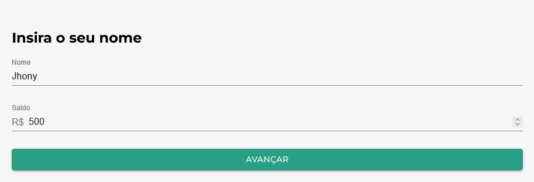
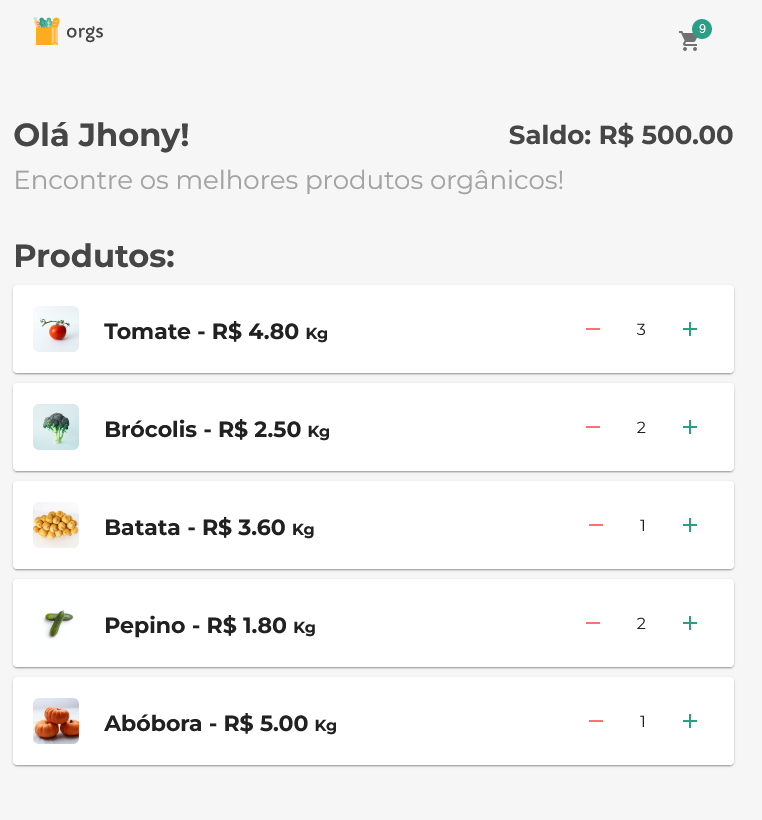
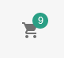
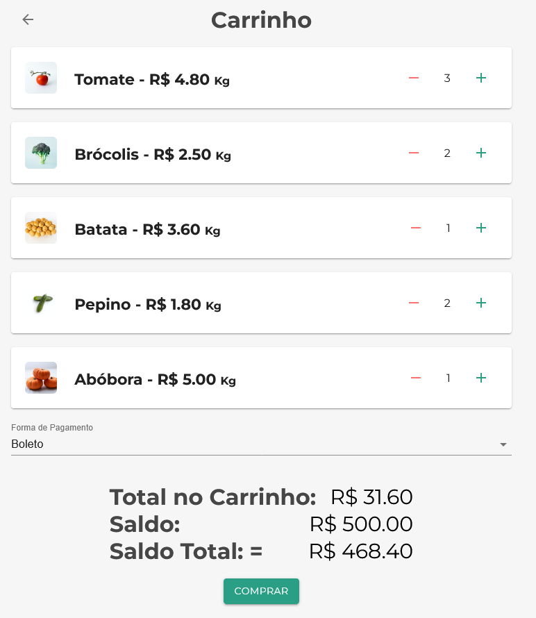

# Orgs :watermelon:

## :pencil:Description

A React project to practice React context API where it was build an e-commerce application.

Orgs offer to its clients the best organics vegetables and fruits from the city.


## :grey_question: How to buy

### Steps to buy Orgs products:  

1. Insert you user name and balance (this balance was previously bought)

2. Add your products to cart

3. Clik on cart icon  

4. Select the payment method (there are desconts for somepayments way) and then click on buy buttom  

5. the purchase price will be automatically  discounted from Your balance


## :dart: What I've learned
I used Context API to create contexts and remove responsibilities from components, learned how to share information between contexts, reuse hook functions to avoid prop drilling.  
I understood how the Memo hook works, which avoids unnecessary rendering and optimizes the site's performance.  
I also created custom hooks, create routes between pages using react-router-dom library and using elements from the material-ui

## :wrench: Tools
- Visual Studio code
- JavaScript
- React JS
- Material-ui

  
## :arrow_forward: Running the project

1. Clone the project

   ```
   git clone https://github.com/mt-torres/orgs
   ```
2. Go to project directory and install node modules

   ```
   npm install
   ```

3. Start sever

   ```
   npm start

Or just acess [mt-torres.github.io/orgs/](https://mt-torres.github.io/orgs/)


